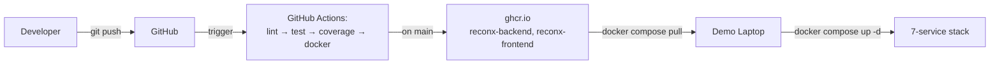

## Runtime architecture

```mermaid
graph TD
    User[Ops Analyst] -->|HTTPS| FE[React + Vite<br/>nginx-alpine]
    FE -->|/api/* proxy| BE[Spring Boot 3<br/>Java 25]
    BE -->|JDBC| PG[(PostgreSQL 16<br/>+ Liquibase)]
    BE -->|KafkaTemplate| K[Apache Kafka<br/>trade-events, recon-results,<br/>system-alerts, DLQ]
    K -->|@KafkaListener| C1[ReconConsumer]
    K -->|@KafkaListener| C2[AuditConsumer]
    K -->|@KafkaListener| C3[AlertConsumer]
    C1 --> PG
    C2 --> PG
    BE -->|/actuator/prometheus| PR[Prometheus]
    PR --> GR[Grafana<br/>dashboards + alerts]
```

## CI/CD + deploy flow

