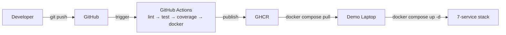

# ReconX

Enterprise trade reconciliation platform in one 60-second read.

ReconX is a Java + React + Kafka operational platform that turns a messy trade-flow story into a deployable demo: REST APIs, JWT auth, PostgreSQL persistence, event-driven consumers, Prometheus scraping, and a Grafana dashboard you can bring up from a clean machine in three commands.

## Quick start

```bash
docker login ghcr.io
docker compose pull
docker compose up -d
```

Once the stack is up, open:
- Swagger UI: http://localhost:8080/swagger-ui.html
- Frontend: http://localhost:5173
- Grafana: http://localhost:3000 (admin / admin)
- Prometheus: http://localhost:9090

## Table of contents

- [Architecture](#architecture)
- [Tech stack](#tech-stack)
- [API documentation](#api-documentation)
- [Monitoring](#monitoring)
- [Kafka topics](#kafka-topics)
- [Load test results](#load-test-results)
- [CI/CD pipeline](#cicd-pipeline)
- [Deploy runbook](#deploy-runbook)
- [Default credentials](#default-credentials)
- [Troubleshooting](#troubleshooting)

## Architecture

```mermaid
graph TD
    User[Ops Analyst] -->|HTTPS| FE[React + Vite<br/>nginx-alpine]
    FE -->|/api/* proxy| BE[Spring Boot 3<br/>Java 25]
    BE -->|JDBC| PG[(PostgreSQL 16<br/>+ Liquibase)]
    BE -->|KafkaTemplate| K[Apache Kafka<br/>trade-events, recon-results,<br/>system-alerts, DLQ]
    K -->|@KafkaListener| C1[ReconConsumer]
    K -->|@KafkaListener| C2[AuditConsumer]
    K -->|@KafkaListener| C3[AlertConsumer]
    C1 --> PG
    C2 --> PG
    BE -->|/actuator/prometheus| PR[Prometheus]
    PR --> GR[Grafana<br/>dashboards + alerts]
```

## Tech stack

- Frontend: React 19 + Vite + nginx-alpine
- Backend: Spring Boot 3 + Java 25 + Spring Security + JWT + Springdoc OpenAPI
- Database: PostgreSQL 16 with Liquibase migrations
- Messaging: Apache Kafka with declarative topics and consumer groups
- Observability: Micrometer, Prometheus, Grafana
- Delivery: Docker Compose, GitHub Actions, GHCR

## API documentation

Swagger is exposed at http://localhost:8080/swagger-ui.html.

The OpenAPI contract is also published at http://localhost:8080/v3/api-docs.

## Monitoring

Three Grafana screenshots from the load-test pass are embedded here for quick decision-making in a demo or hiring conversation.


## Kafka topics

Kafka is the event backbone for the reconciliation platform.

- `trade-events`: main trade ingestion and event fan-out
- `recon-results`: reconciliation outcomes and status updates
- `system-alerts`: operational alerts and notifications
- `trade-events-dlq`: failed or poisoned events for replay and investigation

## Load test results

The load-test script targets a 200-VU sustained trade-creation run with thresholds around:
- `p(95) < 800 ms`
- `p(99) < 2000 ms`
- request failure rate < 2%

The goal is to show that the API remains responsive under concurrency while Kafka and Grafana reflect the pressure in real time.

## CI/CD pipeline



## Deploy runbook

On a clean machine:

1. `docker login ghcr.io`
2. `docker compose pull`
3. `docker compose up -d`

After startup, confirm the core endpoints:
- Frontend: http://localhost:5173
- Swagger UI: http://localhost:8080/swagger-ui.html
- Grafana: http://localhost:3000
- Prometheus: http://localhost:9090

## Default credentials

| Role | Username | Password |
|---|---|---|
| ADMIN | `admin@db.com` | `admin123` |
| TRADER | `trader@db.com` | `trader123` |
| VIEWER | `viewer@db.com` | `viewer123` |
| RECON_ANALYST | `recon@db.com` | `recon123` |

## Troubleshooting

- If the frontend does not load, confirm Docker services are healthy and the backend is reachable on port 8080.
- If Swagger is blank, confirm the backend container is healthy and the app is running with the `dev` or `uat` Spring profile.
- If Grafana shows no data, verify Prometheus is scraping the backend metrics endpoint and the datasource is provisioned.
- If Kafka lag spikes, check the consumer groups, DLQ topic, and message replay flow before changing the API.
