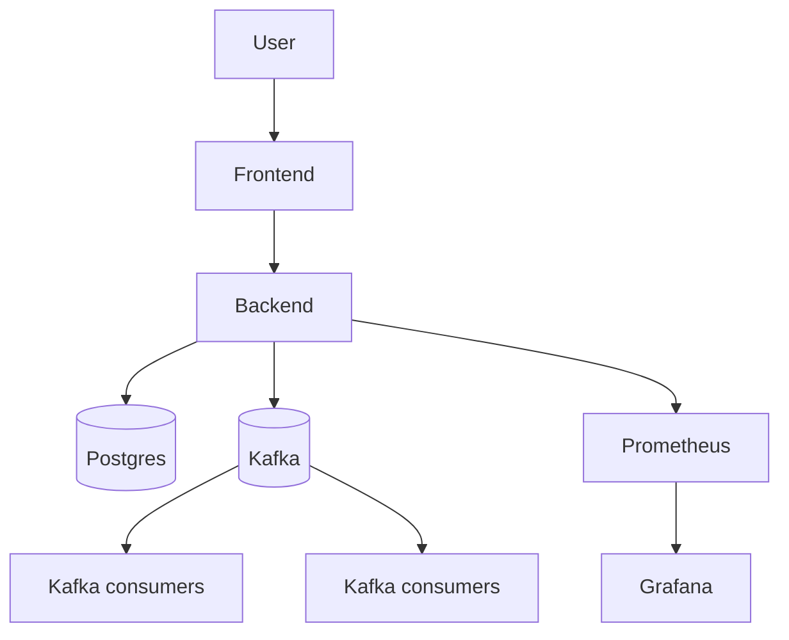
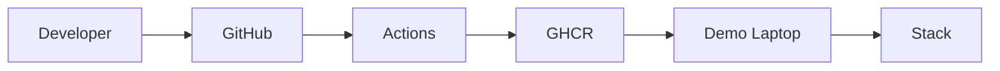

# dbG7

## Runtime architecture

```mermaid
flowchart TD
    User[User] --> Frontend[Frontend]
    Frontend --> Backend[Backend]
    Backend --> Postgres[(Postgres)]
    Backend --> Kafka[(Kafka)]
    Backend --> Prometheus[Prometheus]
    Prometheus --> Grafana[Grafana]

    Kafka --> ConsumerA[Kafka consumers]
    Kafka --> ConsumerB[Kafka consumers]
```

## CI/CD + deploy flow

```mermaid
flowchart LR
    Developer[Developer] --> GitHub[GitHub]
    GitHub --> Actions[Actions]
    Actions --> GHCR[GHCR]
    GHCR --> DemoLaptop[Demo Laptop]
    DemoLaptop --> Stack[Stack]
```
